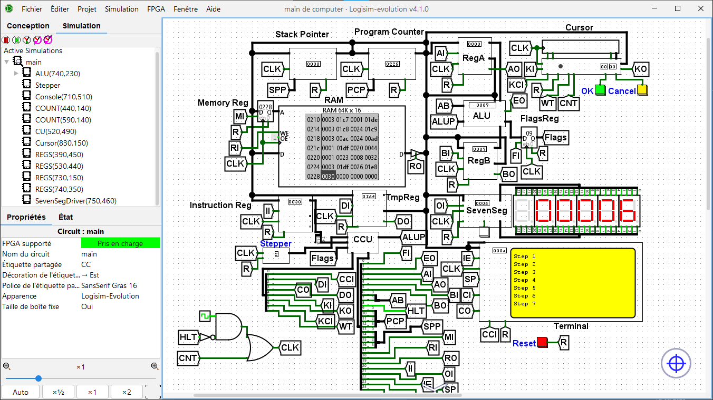

# 16-bit Custom Computer (Logisim) & Toolchain


A complete 16-bit computer architecture designed and simulated primarily in **Logisim**. This project features a fully functional hardware schematic and is backed by a custom C++ software toolchain that includes a high-level programming language compiler, an assembler, and microcode generators to run programs directly on the Logisim hardware.

*(Note: A C++ software emulator is currently under development as a work-in-progress, but the primary way to interact with the system is through the Logisim simulator).*

## 🚀 Features

- **Custom 16-bit Hardware (Logisim):** The core of the project is the `computer.circ` schematic. It features a fully custom datapath, ALU, Registers, and a Control Unit (CCU) that execute a custom Instruction Set Architecture (ISA).
- **Logisim Peripherals:** Simulated interactive console (I/O) and 7-segment multiplexed displays built with logic gates.
- **Custom High-Level Language (`.tom`):** Write programs using a custom language with features like loops (`while`), conditionals (`if`/`else`), arrays, and standard libraries, which are then compiled for the Logisim CPU.
- **Microcode Generator:** C++ scripts automatically generate the Control Unit ROMs and 7-segment display drivers required by the Logisim circuit.
- **C++ Toolchain:** 
  - **Compiler:** Translates `.tom` source code into assembly (`.ass`).
  - **Assembler:** Assembles the code into hexadecimal machine code/RAM images that can be loaded into Logisim's RAM component.

## 📂 Project Structure

```
├── Computer/           # Logisim hardware designs and schematics (Primary Focus)
│   ├── ROMs/           # Generated microcode and hardware ROM files
│   └── computer.circ   # The fully functional 16-bit computer Logisim circuit
├── Assembler/          # C++ source for Assembly to Machine Code translator
├── Code/               # Example programs (.tom) and compiled assembly files
│   ├── libs/           # Standard libraries for the custom language
│   └── game.tom        # Example: Number guessing game written in .tom
├── Compiler/           # C++ source for the custom high-level language compiler
├── Generator/          # Scripts to generate instruction tables & dictionaries
├── Unicode_CU/         # Microcode logic generator for the Logisim Control Unit
├── Simulator/          # [WIP] C++ source for a standalone CPU Emulator
└── run.bat             # Build script for the toolchain
```

## 🛠️ Hardware Architecture Overview



The simulated 16-bit CPU inside Logisim features:
- **Registers:** 16-bit `RegA`, `RegB`, Temporary Register (`RegTmp`), and Instruction Register (`RegInstr`).
- **Pointers & Counters:** Program Counter (`PC`), Stack Pointer (`SP`).
- **ALU Operations:** Addition, Subtraction, Multiplication, Division, bitwise logic (AND, OR, XOR, NOT), Shifts (SHL, SHR), and Comparisons.
- **Memory:** 16-bit addressable RAM module.
- **Control Unit (CCU):** Micro-stepped execution based on custom instruction microcode stored in ROMs.

## 💻 Getting Started (Logisim)

### Prerequisites

- [Logisim Evolution](https://github.com/logisim-evolution/logisim-evolution) to open and simulate the hardware.
- A C++17 compatible compiler (e.g., `g++` via MinGW or GCC) to build the toolchain.

### 1. Generating the Hardware ROMs
Before running the Logisim simulation, you must generate the Control Unit and 7-segment ROM files:
```bat
g++ ./Unicode_CU/unicode_cu.cpp -o ./build/unicode_cu.exe
.\build\unicode_cu.exe
```
This populates the `Computer/ROMs/` directory with the necessary microcode files (`cu_unicode`, `cu_unicode2`, `7_seg`).

### 2. Writing and Assembling a Program
Write your code in `.tom`, compile it, and assemble it into a RAM image:
```bat
# Compile the high-level code
g++ .\Compiler\compiler.cpp -std=c++17 -o .\build\compiler.exe
.\build\compiler.exe ./Code/game.tom ./Code/game.ass

# Assemble into machine code
g++ .\Assembler\assembler.cpp -o .\build\assembler.exe
.\build\assembler.exe ./Code/game.ass
```
*This generates a RAM image file (e.g., `ram_unicode`) containing your compiled program.*

### 3. Running in Logisim
1. Open `Computer/computer.circ` in **Logisim Evolution**.
2. Right-click the **RAM component** and select **Load Image**.
3. Select the generated RAM image file.
4. Enable the simulation clock (`Ctrl + T` or `Cmd + T`) to watch your program execute on the hardware!

## 📜 Example Code (`.tom` Language)

An example of the custom language (from `Code/game.tom`):

```javascript
import "./Code/libs/stdio.tom"
import "./Code/libs/str.tom"

let message1 = "Type a number between 0 and 10 :";
let exceptNum = 3;
let randomNum = 0;
let reponse = "  ";

printLn(message1);
input(reponse);
randomNum = atoi(reponse);

while(randomNum != exceptNum) {
    if (randomNum < exceptNum) {
        printLn(" Too Low, Try again :");
    } else {
        printLn(" Too Hight, try again :");
    }
    input(reponse);
    randomNum = atoi(reponse);
}
printLn(" Correct :-)");
```

## 📝 Roadmap / TODO

- [ ] Complete the C++ standalone Software Simulator.
- [ ] Create a Graphics Driver and update the Logisim schematic for VGA/Display support.
