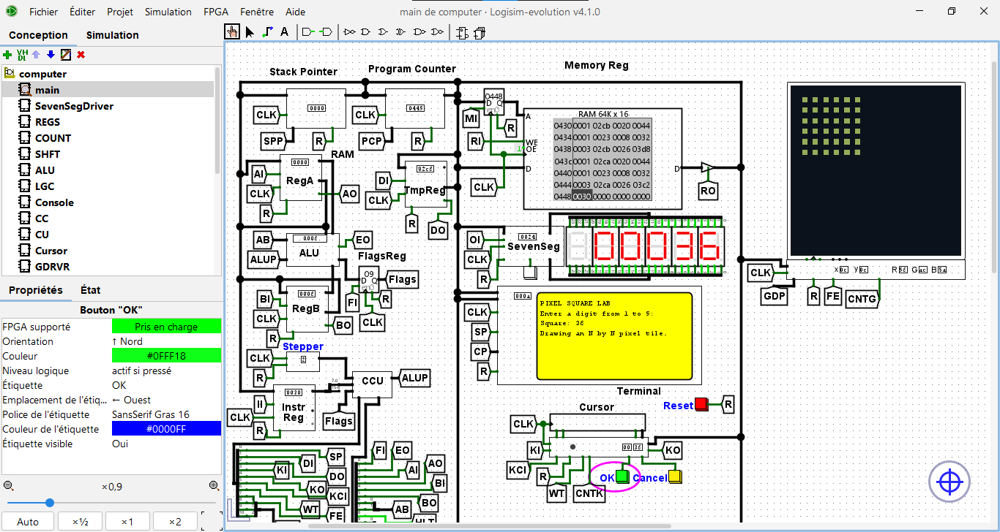

# 16-bit Custom Computer (Logisim) & Toolchain


A complete 16-bit computer architecture designed and simulated primarily in **Logisim**. This project features a fully functional hardware schematic and is backed by a custom C++ software toolchain that includes a high-level programming language compiler, an assembler, and microcode generators to run programs directly on the Logisim hardware.

*(Note: A C++ software emulator is currently under development as a work-in-progress, but the primary way to interact with the system is through the Logisim simulator).*

## 🚀 Features

- **Custom 16-bit Hardware (Logisim):** The core of the project is the `computer.circ` schematic. It features a fully custom datapath, ALU, Registers, and a Control Unit (CCU) that execute a custom Instruction Set Architecture (ISA).
- **Logisim Peripherals:** Simulated interactive console (I/O) and 7-segment multiplexed displays built with logic gates.
- **Graphics Instructions:** Draw pixels, clear the graphics display, and fill it with RGB colors using `gdraw`, `gclear`, `gfill`, and the graphics coordinate/color instructions.
- **Custom High-Level Language (`.tom`):** Write programs using variables, functions, loops (`while`), conditionals (`if`/`else`), arrays, and imports; compile them for the Logisim CPU.
- **Standard Libraries:** `stdio.tom` provides console input/output and 7-segment output; `str.tom` provides integer/string conversion; `math.tom` provides arithmetic helpers and a pseudo-random number generator; `graphics.tom` provides graphics operations.
- **Instruction and Microcode Generators:** `genInst` updates the instruction dictionary/table, while `cu_unicode` generates the Control Unit and seven-segment ROM images.
- **C++ Toolchain:** 
  - **Compiler:** Translates `.tom` source code into assembly (`.ass`).
  - **Assembler:** Assembles the code into hexadecimal machine code/RAM images that can be loaded into Logisim's RAM component.
- **Build Runner:** `run.bat` provides full-build, fast-build, verbose, and cleanup modes.

## 📂 Project Structure

```
├── Computer/           # Logisim hardware designs and schematics (Primary Focus)
│   ├── ROMs/           # Generated microcode and hardware ROM files
│   └── computer.circ   # The fully functional 16-bit computer Logisim circuit
├── Assembler/          # C++ source for Assembly to Machine Code translator
├── Code/               # Example programs (.tom) and compiled assembly files
│   ├── libs/           # Standard libraries for the custom language
│   │   ├── graphics.tom
│   │   ├── math.tom
│   │   ├── stdio.tom
│   │   └── str.tom
│   ├── examples/       # Example programs written in .tom
│   │   ├── guess_number_game.tom
│   │   └── pixel_square_lab.tom
│   └── program.tom     # Build entry point
├── Compiler/           # C++ source for the custom high-level language compiler
├── Generator/          # Scripts to generate instruction tables & dictionaries
├── Unicode_CU/         # Microcode logic generator for the Logisim Control Unit
├── Simulator/          # [WIP] C++ source for a standalone CPU Emulator
└── run.bat             # Build script for the toolchain
```

## 🛠️ Hardware Architecture Overview



The simulated 16-bit CPU inside Logisim features:
- **Registers:** 16-bit `RegA`, `RegB`, Temporary Register (`RegTmp`), and Instruction Register (`RegInstr`).
- **Pointers & Counters:** Program Counter (`PC`), Stack Pointer (`SP`).
- **ALU Operations:** Addition, Subtraction, Multiplication, Division, bitwise logic (AND, OR, XOR, NOT), Shifts (SHL, SHR), and Comparisons.
- **Memory:** 16-bit addressable RAM module.
- **Control Unit (CCU):** Micro-stepped execution based on custom instruction microcode stored in ROMs.

## 💻 Getting Started (Logisim)

### Prerequisites

- [Logisim Evolution](https://github.com/logisim-evolution/logisim-evolution) to open and simulate the hardware.
- A C++17 compatible compiler (e.g., `g++` via MinGW or GCC) to build the toolchain.

### Build Commands
Run these commands from the repository root. `fast_run` is the default if `run.bat` is launched without an argument; it uses the existing compiler and assembler executables.

```bat
run.bat help
run.bat genInst
run.bat cu_unicode
run.bat compile_c
run.bat assembly_c
run.bat fast_run
run.bat fast_run verbose
run.bat clean_run
```

- `genInst` builds and runs the instruction table/dictionary generator.
- `cu_unicode` builds and runs the Control Unit and seven-segment ROM generator.
- `compile_c` rebuilds the TOM compiler and compiles `Code/program.tom` to `Code/program.ass`.
- `assembly_c` rebuilds the assembler and assembles `Code/program.ass` into `ram_unicode`.
- `fast_run` compiles and assembles using the already-built tools.
- `clean_run` does the same as `fast_run`, then removes `temp.tom`, `tempf.ass`, and `Code/program.ass`. The generated RAM image is not removed.
- Add `verbose` to `compile_c`, `assembly_c`, `fast_run`, or `clean_run` to pass `--debug` to the relevant tool.

The ROM generator can also be run directly:

```bat
g++ ./Unicode_CU/unicode_cu.cpp -o ./build/unicode_cu.exe
.\build\unicode_cu.exe
```
This populates the `Computer/ROMs/` directory with the necessary microcode files (`cu_unicode`, `cu_unicode2`, `7_seg`).

### Run in Logisim
Set `LOGISIM_PATH` to the directory containing `logisim-evolution-4.1.0-all.jar`, then run the launcher from the repository root:

```bat
set "LOGISIM_PATH=C:\path\to\logisim"
start_simulator.bat
```

With no argument, the launcher opens `Computer\\computer.circ`. To open another circuit, pass the path to its `.circ` file:

```bat
start_simulator.bat path\\to\\other.circ
```

In Logisim Evolution, right-click the RAM component, select **Load Image**, and choose the generated `ram_unicode` image. Enable the simulation clock (`Ctrl + T` or `Cmd + T`) to run the program.

## 📜 Example Code (`.tom` Language)

The repository includes two programs under `Code/examples/`:
- `guess_number_game.tom` uses console I/O, string conversion, comparisons, and `rand(1, 10)`.
- `pixel_square_lab.tom` reads a digit, calculates its square, displays the result, and draws a colored pixel tile.

The random helper is pseudo-random, not a hardware entropy source. Its sequence depends on the generator state stored in RAM; reloading the RAM image restores the initial state.

For example, graphics code imports the graphics library and uses its drawing helpers:

```javascript
import "./Code/libs/graphics.tom"

gclear();
gfill(12, 18, 28);
gdraw(10, 10, 255, 100, 0);
```

## 📝 Roadmap / TODO

- [ ] Complete the C++ standalone Software Simulator.
